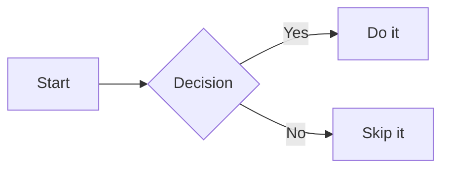

# What You Can Safely Use in a Markdown Document

Markdown was designed to be simple, readable, and portable — but in practice, not all Markdown is equal. The same document can look perfect in one tool and break in another. This article defines a practical "safe subset" of Markdown: elements you can rely on across renderers, and where to draw the line.

---

## Why This Matters

Markdown has no single governing standard. John Gruber's original 2004 spec left many edge cases undefined, and over the years dozens of parsers emerged with their own interpretations. Today you'll encounter:

- **CommonMark** — a rigorous, unambiguous specification that most modern tools have adopted as a baseline
- **GitHub Flavored Markdown (GFM)** — CommonMark plus tables, task lists, strikethrough, and autolinks
- **Pandoc Markdown** — extended with footnotes, definition lists, math, and more
- **Obsidian / Typora / Notion** — proprietary extensions layered on top of CommonMark

The practical consequence: a feature that works in your editor may not survive a copy-paste into a different tool, a static site generator, or a documentation pipeline.

---

## The Safe Core: CommonMark

If a document needs to work anywhere, write to **CommonMark**. It is the closest thing Markdown has to a universal standard, and it is supported by GitHub, GitLab, VS Code, most static site generators (Hugo, Eleventy, Jekyll), Pandoc, and virtually every modern Markdown library.

CommonMark defines the following elements precisely:

### Headings

ATX-style headings (hash prefix) are universally safe. Setext-style (underline with `===` or `---`) works but is less portable and harder to maintain.

```markdown
# Heading 1
## Heading 2
### Heading 3
```

**Recommendation:** Use ATX-style exclusively. Always put a space after the `#`.

### Paragraphs and Line Breaks

A blank line creates a new paragraph. A single line break within a paragraph is treated as a space — the rendered output is a single paragraph. This is one of the most common surprises for new users.

To force a hard line break within a paragraph, end the line with two spaces or a backslash (`\`) before the newline. The two-space method is fragile (invisible, easily stripped by editors); prefer the backslash where hard breaks are needed — but question whether you need them at all.

### Emphasis

```markdown
*italic* or _italic_
**bold** or __bold__
***bold italic*** or ___bold italic___
```

All four forms are safe in CommonMark. Prefer asterisks over underscores to avoid ambiguity when emphasis appears inside a word (e.g., `file_name_here` — underscores in the middle of a word are not treated as emphasis in CommonMark, but behavior varies in older parsers).

**Recommendation:** Use asterisks. Always.

### Lists

Unordered lists: use `-`, `*`, or `+` as bullets. Consistent use of a single character across the document is safest.

```markdown
- Item one
- Item two
  - Nested item
```

Ordered lists: the number itself doesn't matter — all parsers will render a sequential list regardless.

```markdown
1. First
1. Second
1. Third
```

Nesting requires consistent indentation. CommonMark requires 4 spaces (or equivalent tab) for continuation paragraphs, but 2-space indentation for sub-lists is widely accepted.

**Recommendation:** Use `-` for bullets, `1.` for numbered lists, 2-space indent for nesting.

### Code

Inline code with backticks is universally safe:

```markdown
Use the `printf()` function.
```

Fenced code blocks with triple backticks are CommonMark and safe everywhere:

````markdown
```python
def hello():
    print("Hello, world")
```
````

The language identifier after the opening fence is not part of CommonMark proper, but is supported by every renderer that handles syntax highlighting — and silently ignored by those that don't. It is safe to include.

**Syntax highlighting:** Many tools read the language identifier and apply color coding to the code block. VS Code does this both in the editor and in the Markdown preview. GitHub, Obsidian, and most documentation sites do the same. The code itself is never modified — only how it is displayed changes. The highlighting is purely visual and handled entirely by the renderer; it has no effect on portability. A `python` block that is color-coded in VS Code will still render as a plain code block in a tool that does not support syntax highlighting.

Indented code blocks (4 spaces) are original-spec Markdown, supported everywhere, but harder to read and maintain. Avoid them in favor of fenced blocks.

### Links and Images

```markdown
[Link text](https://example.com)
[Link with title](https://example.com "Hover text")


```

Reference-style links are also safe and improve readability in long documents:

```markdown
See [the documentation][docs] for details.

[docs]: https://example.com/docs
```

**Note on images:** Whether images render depends on the renderer having access to the file. Relative paths are safe in local editors and static sites. Remote URLs (https) are safe everywhere except environments that block external resources.

### Blockquotes

```markdown
> This is a blockquote.
> It can span multiple lines.
>
> And multiple paragraphs.
```

Nested blockquotes (`>>`) work in CommonMark but visual treatment varies.

### Horizontal Rules

```markdown
---
```

Three or more hyphens, asterisks, or underscores on their own line. All three forms work; `---` is the most common.

**Watch out:** `---` immediately below a line of text is interpreted as a Setext heading, not a rule. Always put a blank line before `---` if it follows a paragraph.

### Escaping

Backslash escaping works for all ASCII punctuation that has special meaning in Markdown:

```markdown
\*not italic\*
\# not a heading
\[not a link\]
```

---

## Extended Syntax: Use With Awareness

The following elements are widely supported but not part of CommonMark. They work in GitHub, most documentation tools, and many editors — but you may hit problems in strict CommonMark renderers or lightweight parsers.

### Tables (GFM)

```markdown
| Column A | Column B | Column C |
|----------|----------|----------|
| Value    | Value    | Value    |
```

Alignment with `:` in the separator row is also supported:

```markdown
| Left | Center | Right |
|:-----|:------:|------:|
```

Tables work in GitHub, GitLab, VS Code, Obsidian, most static site generators. They do **not** work in strict CommonMark-only parsers. If your pipeline uses a minimal CommonMark library (e.g., in some CI tools or API responses), tables will render as raw text.

**Use when:** You know the target renderer. Add a note in your documentation that the file requires a GFM-compatible renderer if portability is critical.

### Task Lists (GFM)

```markdown
- [x] Done
- [ ] Not done
```

Works on GitHub, GitLab, Obsidian, and several other tools. Renders as plain list items with literal `[x]` in standard CommonMark.

### Strikethrough (GFM)

```markdown
~~deleted text~~
```

Widely supported in GFM contexts. Renders as literal `~~` in strict CommonMark.

### Mermaid Diagrams

Mermaid is a diagramming language embedded inside fenced code blocks with the `mermaid` language identifier:

````markdown

````

When the renderer supports Mermaid, this produces a rendered diagram. When it does not, it falls back to a plain code block — which is a clean, readable degradation compared to broken inline HTML.

**Where Mermaid is supported natively:**
- GitHub (flowcharts, sequence diagrams, Gantt, pie, class diagrams, ER diagrams, and more)
- GitLab
- Notion
- Obsidian (with the built-in Mermaid plugin enabled)
- Docusaurus
- GitBook
- Many documentation tools (Astro, MkDocs with plugins, VitePress)

**Where it is not supported:**
- Standard CommonMark renderers with no Mermaid integration
- VS Code (requires an extension)
- Pandoc (renders as code block unless a filter is added)
- Most plain Markdown-to-HTML converters without explicit Mermaid setup

**Diagram types and their reliability:**

| Diagram type | GitHub | GitLab | Obsidian | Notes |
|---|---|---|---|---|
| Flowchart (`flowchart` / `graph`) | ✅ | ✅ | ✅ | Most widely supported |
| Sequence diagram | ✅ | ✅ | ✅ | Well supported |
| Gantt chart | ✅ | ✅ | ✅ | Good support |
| Class diagram | ✅ | ✅ | ✅ | Good support |
| ER diagram | ✅ | ✅ | ⚠️ | Obsidian version-dependent |
| State diagram | ✅ | ✅ | ✅ | Good support |
| Pie chart | ✅ | ✅ | ✅ | Good support |
| Mindmap | ✅ | ⚠️ | ⚠️ | Newer, less consistent |
| Timeline | ✅ | ⚠️ | ⚠️ | Newer, less consistent |

**Version skew is a real risk.** Mermaid releases new diagram types and syntax regularly. A diagram that uses a feature from Mermaid v10 may fail silently on a platform that ships an older version. Stick to flowcharts, sequence diagrams, and class diagrams if portability across platforms matters.

**Recommendation:** Use Mermaid freely in GitHub-hosted projects and documentation sites where you control the toolchain. Treat newer diagram types as environment-specific. Always verify that the diagram renders correctly in your target platform before publishing.

### Footnotes

Pandoc and many documentation tools support footnotes:

```markdown
This is a claim.[^1]

[^1]: The supporting reference.
```

Not part of GFM or CommonMark. Avoid unless you know your target renderer supports them.

---

## Inline HTML: Handle With Care

Markdown allows raw HTML inside a document, and CommonMark parsers will pass it through to the output. This gives you access to anything HTML can express — but it comes with significant trade-offs.

**When inline HTML is acceptable:**
- You control both the source and the renderer
- The output is always HTML (not PDF, Word, or plain text)
- You need something Markdown genuinely cannot express (e.g., `<sub>`, `<sup>`, `<details>`, `<kbd>`)

**When to avoid it:**
- The document may be processed by a Markdown-to-Word or Markdown-to-PDF pipeline
- The document may be displayed in a sandboxed environment (GitHub README, Notion, some CMSes) that sanitizes HTML
- You want the document to remain readable as plain text

**Security note:** Many renderers sanitize HTML before output to prevent XSS. Do not rely on inline HTML for anything that requires preservation of arbitrary attributes or JavaScript. On platforms like GitHub, `<script>` tags and event attributes are stripped.

**Recommendation:** Treat inline HTML as an escape hatch, not a default tool. If you reach for it regularly, reconsider the document structure.

---

## Elements to Avoid for Portability

| Element | Problem |
|--------|---------|
| Setext headings (`===`, `---`) | Ambiguous, visually fragile, avoid |
| Indented code blocks | Superseded by fenced blocks; surprising interaction with lists |
| Raw HTML (complex) | Stripped in many sandboxed environments |
| Footnotes | Non-standard; renderer-dependent |
| Definition lists | Pandoc-only; not in CommonMark or GFM |
| Mermaid (newer types) | Mindmap, Timeline etc. are version-dependent; stick to flowchart/sequence/class |
| Math (`$...$`, `$$...$$`) | Requires KaTeX/MathJax; not universally available |
| Custom containers (`::: note`) | Tool-specific extensions only |
| Nested lists deeper than 2 levels | Technically valid, but often breaks in editors and exporters |

---

## Practical Recommendations by Context

**GitHub / GitLab README or wiki:** Write GFM. Tables, task lists, and strikethrough are safe. Avoid footnotes.

**Documentation site (Docusaurus, MkDocs, Astro):** Check which parser is configured. Most default to CommonMark + GFM. MDX (Docusaurus) supports JSX components inside Markdown — powerful, but not portable.

**Obsidian vault:** Obsidian's own extensions (wiki links `[[...]]`, callouts) are not portable to other tools. Use CommonMark core if the files will ever leave the vault.

**Pandoc pipeline (Word, PDF, LaTeX output):** Pandoc is the richest Markdown parser available. Its extensions (footnotes, definition lists, raw LaTeX) are safe inside a Pandoc pipeline but will not work elsewhere.

**API responses, database storage, or unknown downstream:** Write strict CommonMark only. No tables, no HTML, no extensions. Treat the document as potentially rendered by anything.

---

## The Safe Subset at a Glance

| Element | Safe everywhere (CommonMark) |
|---------|------------------------------|
| ATX headings (`#`) | ✅ |
| Paragraphs and blank lines | ✅ |
| Bold and italic (asterisks) | ✅ |
| Unordered and ordered lists | ✅ |
| Fenced code blocks (` ``` `) | ✅ — language tag enables syntax highlighting where supported |
| Inline code (backticks) | ✅ |
| Links and images | ✅ |
| Blockquotes | ✅ |
| Horizontal rules (`---`) | ✅ |
| Backslash escapes | ✅ |
| Tables | ⚠️ GFM only |
| Task lists | ⚠️ GFM only |
| Strikethrough (`~~`) | ⚠️ GFM only |
| Footnotes | ⚠️ Pandoc / extended only |
| Inline HTML | ⚠️ Renderer-dependent |
| Mermaid diagrams (core types) | ⚠️ GitHub/GitLab/Obsidian — not CommonMark |
| Mermaid (newer types) | ❌ Version-dependent, avoid for portability |
| Math | ❌ Requires special support |
| Wiki links | ❌ Tool-specific |

---

## Summary

The safest Markdown is CommonMark Markdown. If you write only the elements in the "safe everywhere" column above, your document will render correctly in any modern renderer without surprises.

When you need tables, strikethrough, or task lists, GFM is your next step — it is widely supported and the practical standard for most collaborative platforms.

Inline HTML and parser-specific extensions should be treated as deliberate choices, not defaults. Use them only when you know your rendering environment and have accepted the portability trade-off.

A document that degrades gracefully is better than a document that depends on a specific tool. Write for the reader, not for the renderer.
